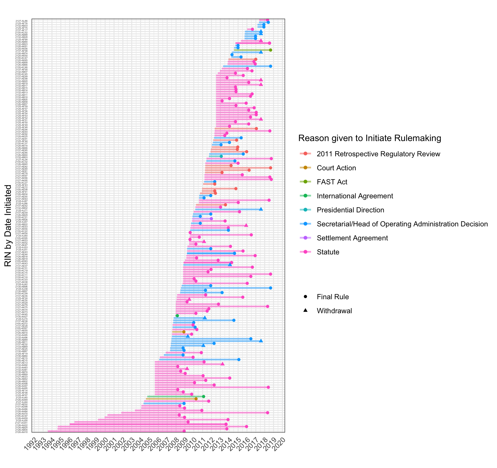
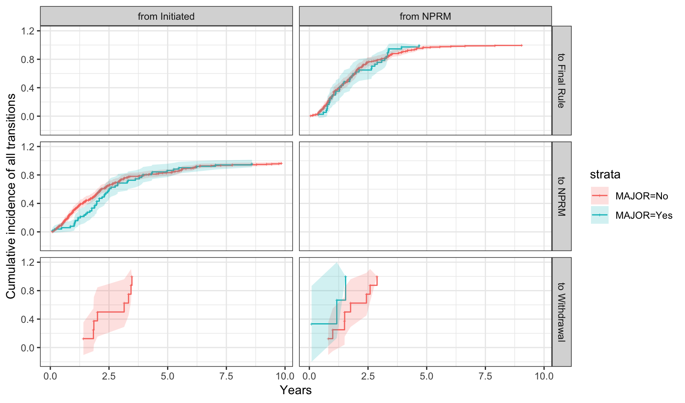

# Introduction

Rulemaking is important.

Scholars have thus far focused on the second, more transparent phase of rulemaking after proposed rules are published.

Yet much happens before proposed rules are published.

We address this gap.

We make three contributions: 

- We describe when and why rulemaking projects get started, providing the first systematic analysis into how long it takes to write a rule. 

- We compare the factors that influence the fate of a rulemaking project before and after an NPRM is published.

- We assess why rulemaking projects move slower or faster at pre- and post- NPRM stages. 

In doing so, we make several methodological contributions. First, we apply multi-state duration modeling to policymaking. Most policy processes involve multiple stages marked by important transitions, such as the publication of a draft or approval of different branches of government, but empirical work rarely models policymaking as a multi-stage process. Furthermore, we develop a suite of new, more refined measures of factors hypothesized to influence agency policymaking, including agency resources and leadership, congressional attention and opposition, and the threat of litigation. 

# The rulemaking process

Scholars of bureaucratic policymaking have long sought to explain why agencies choose to write rules, the fate of these initiatives, and how long it takes. 

## Why agencies write rules

## The fate of rulemaking projects

## The duration and timing of rulemaking

# Data and Methods 

## Data 
We combine a large dataset on all rulemaking processes cited in the Unified Agenda or by the Office of Information and Regulatory Affairs with a smaller dataset of over 350 Department of Transportation rules about which we have collected extremely detailed information extending before the publication of an NPRM. These data come from monthly internal rulemaking status reports that DOT. 

# Hypotheses

Presidential transitions increase the likelihood of withdrawal in both pre- and post- NPRM stages, i.e., compared to publication of an NPRM or publication of a final rule given that an NPRM has been published. 

Agencies with more resources per rule are more likely to finish proposed and final rules on time. Specifically, agencies with more policy-level staff per rulemaking project are more likely to deliver rulemaking documents to the Office of the Secretary and the White House for review and ultimately publish documents on time.

# Results

## Reasons for rulemaking
(descriptive statistics)

## Causes of delay 
(descriptive statistics)

[Rulemaking projects completed 2008-2018, Reasons given for Delay](Figs/completion-time-by-delay-1.png)

## Factors that affect the fate of a rulemaking project
(models)

### Publication or withdrawal
Rulemaking projects may ultimately result in a final rule being published or the project being withdrawn. However, most final rules in our data first had a draft rule, known as a Notice of Proposed Rulemaking or NPRM published. An agency may terminate or withdraw a rulemaking project before or after the draft is published. We thus consider three possible outcomes in the first stage of the policy process: publication of a draft rule, withdrawal, and, very rarely, publication of a final rule without a draft. For rules that reach the post-NPRM stage, there are two outcomes: publication of a final rule or withdrawal.

#### External political pressure
[] (Figs/mstate-presidential-transitions-fate-1.png)

[] (Figs/mstate-congress-attention-fate-1.png)

[] (Figs/mstate-congress-opposition-fate-1.png)

### Publication on time
We now consider the outcome of being published "on time" according to the agency's own timeline. The transitions of interest are an on-time NPRM publication, a delayed NPRM publication, an on-time Rule publication, and a delayed rule publication. Withdrawal at each stage is also possible, leading to three possible outcomes at each stage. 

[] (Figs/mstate-ontime-fate.png)

Expanding on this model, we consider additional transitions that most rulemaking projects go through at each stage, delivery to the Office of the Secretary and the Office of Management and Budget. 

[] (Figs/mstate-ontime-OST-OMB-fate-1.png)

## Factors that affect the speed of the policy process

#### External political pressure
[] (Figs/mstate-presidential-transitions-rate-1.png)

[] (Figs/mstate-congress-attention-rate-1.png)

[] (Figs/mstate-congress-opposition-rate-1.png)

#### Rule complexity

[] (Figs/mstate-has-ANPRM-rate-1.png)

# Discussion

# Conclusion

